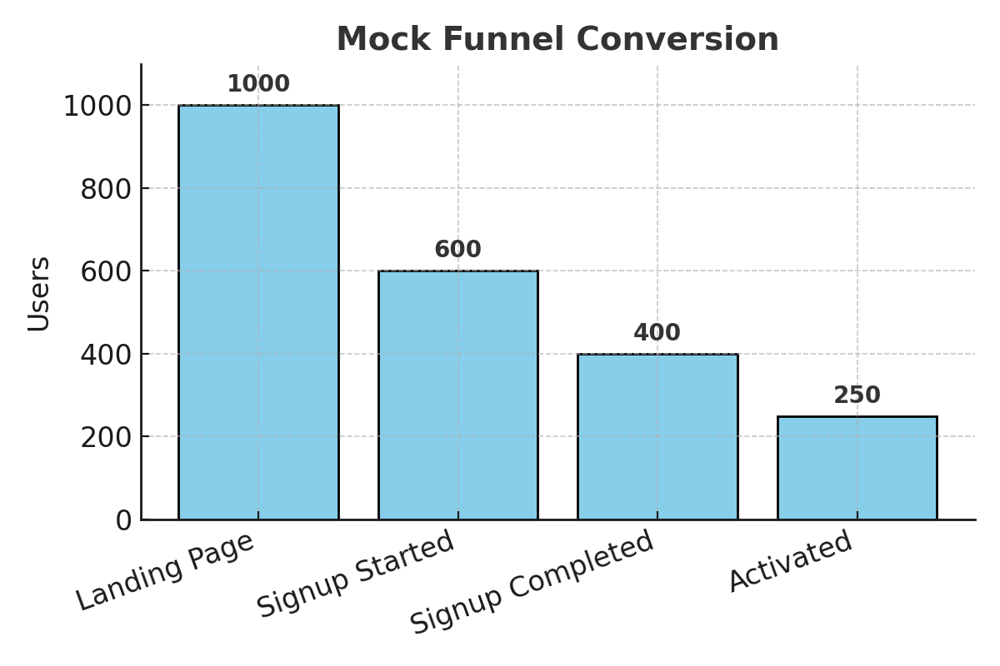
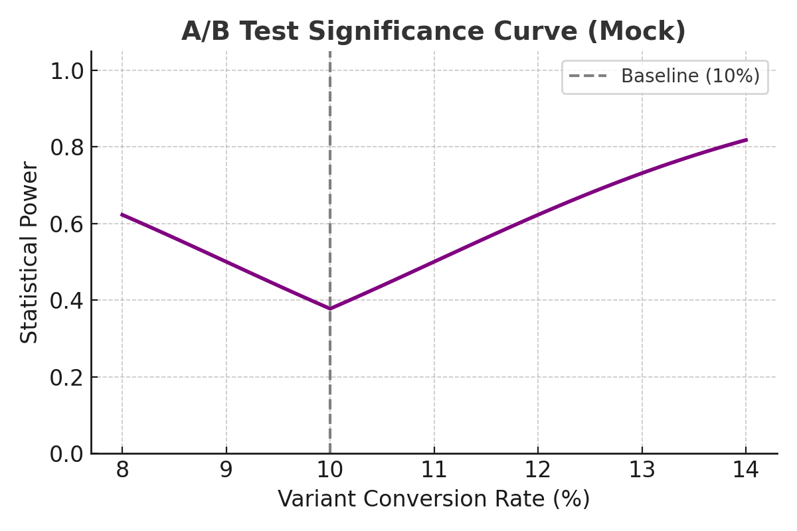

# 📊 Analytics & Experiments

Utilities and templates for **funnels, churn, and A/B tests**.  
These are **PM-friendly tools** to reason about metrics, experiment design, and data-driven decisions.  

---

## 📂 Contents
- 🧮 **[ab_test_calculator.py](./ab_test_calculator.py)** → Sample size & significance calculator (CLI).  
- 📈 **[analyze_funnel.ipynb](./analyze_funnel.ipynb)** → Funnel analysis notebook with quick visualizations.  
- 🗂 **[funnel_example.csv](./funnel_example.csv)** → Mock funnel dataset for demos.  

---

## 📊 Example Funnel Visualization

| Step             | Users | Drop-off |
|------------------|-------|----------|
| Landing Page     | 1,000 | -        |
| Signup Started   |   600 | 40%      |
| Signup Completed |   400 | 33%      |
| Activated        |   250 | 38%      |

➡ Funnel conversion = **25%** (Landing → Activated).  

---

## 📈 A/B Test Significance Curve

**Interpretation:**  
- Baseline = 10% conversion rate.  
- As the variant’s conversion rate diverges (e.g., 12% or 14%), statistical power rises.  
- Helps decide required sample size before launch.  

---

## 🚀 Why This Repo
As a Product Manager, I use these tools to:
- Validate whether **experiments are statistically sound**.  
- Identify **funnel bottlenecks** and prioritize fixes.  
- Make **data-driven roadmap decisions** instead of gut-feel.  

---

📌 *These are simplified, portfolio-friendly versions of the tools I use for product analytics and growth experiments.*
